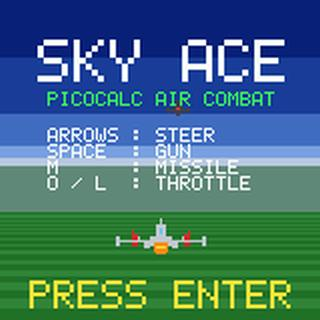
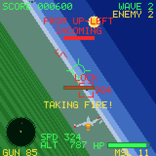

# Sky Ace（pico_skyace）

PicoCalc（RP2040 標準構成）向けの、初代エースコンバット風※・後方追従視点の
疑似 3D 空戦ゲームです。

## 遊び方

### 操作

| キー | 動作 |
|------|------|
| ← / → | ロール（旋回） |
| ↑ / ↓ | 機首上げ / 下げ |
| Space | 機銃（残弾制・押しっぱなし） |
| M | ミサイル発射（残弾制、ロックオン中は誘導） |
| O / L | 加速 / 減速 |
| Enter | タイトル／デモから開始、ゲームオーバーから再出撃、ポーズ解除 |
| P | プレイ中にポーズ／ポーズ解除 |
| Esc | プレイ中にポーズ、ポーズ中・ゲームオーバー・デモからタイトルへ |
| F5 | SDカードの `/screenshots/` へスクリーンショット保存 |

### 戦闘の流れ

画面中央の照準に敵を約0.7秒とらえ続けると LOCK になります。LOCK 中に M を押すと
誘導ミサイルを発射できます。ミサイルは翼下から左・右交互に出て、機銃は機首から
1本のトレーサを描きます。画面外の敵は黄色い矢印で方向を案内します。

各 Wave の開始直後は敵が遠巻きに巡航します。残敵が開始時の半分以下になるか、
Wave 開始から20秒を超えると敵が攻撃フェーズへ移り、追尾・射撃が積極的になります。
敵の射線に入ると `INCOMING` と攻撃元の方向が表示され、「ブー、ブー、ブー」の接近警告、
発射準備時の連続した「ピー」という警告が順に鳴ります。上昇中は速度が下がり、下降中は
速度が上がります。

GUN とミサイルには残弾があり、両方が尽きるとゲームオーバーです。敵を全滅させると、
最後の爆発が終わってから `WAVE CLEAR` が表示され、次の Wave で兵装が補給されます。
被弾時は自機が点滅します。ゲームオーバーは10秒後にタイトルへ戻ります。

ハイスコアはタイトル画面とゲームオーバー画面に表示されます。SDカードが使える場合は
結果画面で更新した記録を保存し、次回起動時にも読み込みます。SDカードがない場合や
書き込みに失敗した場合も、現在の電源投入中は記録を保持してそのまま遊べます。

タイトルに30秒とどまると、実プレイと同じ敵AI・武器・衝突・HUDで動くデモへ移ります。
デモは Wave 4 から始まり、タイトル曲を流しながら自動操縦で攻撃します。デモは30秒で
タイトルへ戻ります。

## スクリーンショット

提供いただいた戦闘中キャプチャ（160×160）を、README掲載用に2倍化した画面です。

| タイトル画面 | 戦闘中画面 |
|---|---|
|  |  |

## ゲームの特徴

- ウェーブ制で、Fighter（標準）、Bomber（低速・高耐久・大型機）、Interceptor（高速・低耐久・高命中率）が登場します。
- 8kHz IRQ ミキシングによる効果音・エンジン音・5チャンネルのチップチューン風BGMを搭載しています。
- タイトル曲は短いフィル付きのメニュー・グルーヴで、主旋律は拡張フレーズを2回単位で繰り返します。ゲームオーバー時は専用BGMへ切り替わります。
- デモ中はタイトル曲を優先し、戦闘効果音とエンジン音を抑制します。
- 出撃結果のハイスコアを表示し、SDカードがあればチェックサム付きで次回起動へ引き継ぎます。

## 必要なハードウェア

- [PicoCalc](https://www.clockworkpi.com/picocalc)（コアボードは Raspberry Pi Pico
  (RP2040) を使用。Pico 2 / RP2350 では未検証）
- 320×320 ST7365P LCD、I2C キーボード（PicoCalc 標準構成）
- スクリーンショットとハイスコア保存を使う場合は SD カード（FAT32 フォーマット）

## 技術情報

- 内部 160×160 RGB565 レンダリング → PIO SPI で2倍拡大し、320×320へ4象限で転送
- 固定小数点（位置 Q8 / 三角関数 Q12、角度は brad = 256 で一周）
- 敵機は3D座標を持ち、距離に応じたスプライト拡縮で描画
- 地平線はピッチで上下・ロールで傾斜し、地面は遠近ストライプでスクロール
- 画面転送の理論上限は約19fps（ゲームタイマー33ms、sysclk 250MHz、LCD 31.25MHz SPI相当。電源再投入時の表示安定性を優先）。実機の処理時間ベースラインは [`実機性能ログの取り方`](docs/PERF_DIAGNOSTICS.md) を参照してください。

## ビルド

[pico-sdk](https://github.com/raspberrypi/pico-sdk) と ARM GCC ツールチェーン、
CMake、Ninja が必要。

```sh
export PICO_SDK_PATH=/path/to/pico-sdk
cmake -S . -B build -G Ninja
cmake --build build
# 成果物: build/pico_skyace.uf2
```

ハードウェアに依存しないロジックテストは、別のホスト用CMakeプロジェクトで実行できます。

```sh
cmake -S tests -B build-host-tests -G Ninja
cmake --build build-host-tests
ctest --test-dir build-host-tests --output-on-failure
```

### エミュレーター検証

`picocalc_emu` と `picoem-picocalc` が同じworkspaceにある場合、Pico用ELFからraw BINを作り、
PicoCalcのLCD・キーボード・音声モデル上で実行できます。runnerはUF2を直接読まないため、
まず次の変換を行います。

```sh
arm-none-eabi-objcopy -O binary build/pico_skyace.elf build/pico_skyace.bin
runner=/home/fuyuki/pico_dvl/codex/picoem-picocalc/target/release/picocalc-run
bootrom=/home/fuyuki/pico_dvl/codex/picoem-picocalc/roms/rp2040/bootrom-rp2040-b2.bin
out=/tmp/pico-skyace-emu-run
mkdir -p "$out/snapshots"
"$runner" --bin build/pico_skyace.bin --bootrom "$bootrom" \
  --board picocalc --lcd-variant pio-rgb565 --keyboard --sd \
  --scenario tests/emulator/boot_play_smoke.json \
  --snapshot-dir "$out/snapshots" --uart "$out/uart.log" \
  --json "$out/report.json"
```

`report.json` の `verdict.status` と `scenario.status` が `pass` であること、
`exception`・`unsupported_mmio`・キーボードdropがないことを確認します。これは登録targetの
正式回帰判定ではなく、新規BINの診断実行です。実行シナリオと保存済み結果は、最新の
[`v0.9.18 検証ビルド記録`](docs/validation/2026-09-12-v0.9.18/BUILD.md)（以前の記録は
[`v0.9.17 ビルド記録`](docs/validation/2026-09-12-v0.9.17/BUILD.md)、
[`v0.9.13 ビルド記録`](docs/validation/2026-09-12-v0.9.13/BUILD.md)、
[`v0.9.12 ビルド記録`](docs/validation/2026-09-12-v0.9.12/BUILD.md)、
[`v0.9.11 ビルド記録`](docs/validation/2026-09-12-v0.9.11/BUILD.md)、
[`v0.9.10 ビルド記録`](docs/validation/2026-09-12-v0.9.10/BUILD.md)、
[`v0.9.5 ビルド記録`](docs/validation/2026-09-12-v0.9.5/BUILD.md)、
[`v0.9.4 ビルド記録`](docs/validation/2026-09-12-v0.9.4/BUILD.md)、
[`v0.9.3 ビルド記録`](docs/validation/2026-09-10-demo/BUILD.md)および
[`Phase 1ビルド記録`](docs/validation/2026-09-09-phase1/BUILD.md)）を参照してください。

製品設定（`PICO_SKYACE_TITLE_DEMO_DELAY_MS`なし）の完全なTitle→Demo→Titleと
GameOver→Titleの実行条件・UART時刻・SHA-256付きレポートも、v0.9.5以降は
各バージョンのビルド記録に保存します。v0.9.3までの記録は
[`v0.9.3 ビルド記録`](docs/validation/2026-09-10-demo/BUILD.md)を参照してください。
GameOverの長時間経路だけは、LCD画素デコードを省略したUART専用高速PIOシンクを
使うため、公式LCDモデルでの表示・通常PIO転送の合格とは別扱いです。

厳密ガード、直接リトライ、ポーズ復帰、武器入力境界、SDあり／なし、公式LCDの
framebuffer、代表2分負荷の追加証跡は [`非実機検証記録`](build-artifacts/2026-09-10-nonhardware/)
にまとめています。実機確認と20分負荷計測は別のリリースゲートです。

実機での性能値を記録する場合は、診断ビルドでデモを放置して集計する手順を
[`実機性能ログの取り方`](docs/PERF_DIAGNOSTICS.md)にまとめています。診断コードは
製品ビルドでは無効です。

BOOTSEL を押しながら USB 接続し、`pico_skyace.uf2` をドラッグ&ドロップで書き込む。

## LCD ドライバについて（重要）

`src/platform/lcd_rgb565_pio.cpp`・`.h`・`lcd_spi_min.pio` は、著者の他の
RP2040/PicoCalc プロジェクトで実機検証済みの転送実装を流用したもので、
**転送粒度とCS操作は変更しないこと。** 独自に似たロジックを再実装すると、
CS（チップセレクト）を長時間下げっぱなしにする連続バーストでパネルの同期が
崩れるという、座標計算とは無関係な低レベルの電気的問題を再現してしまう。

背景・原因調査・教訓の詳細は [docs/LCD_BRINGUP_HISTORY.md](docs/LCD_BRINGUP_HISTORY.md)
を参照。画面が崩れる場合は、まずこの3ファイルの転送粒度と、
`config/board_config.h`の保守的なクロック設定が保たれているかを疑うこと。
描画の呼び出し方を変えたい場合は `picocalc_display.cpp`（アダプタ層）を変更する。

## ログ

UART0（USB-C の CH340 経由）、115200 bps 8N1。起動時の version / build id /
sysclk / 直前がウォッチドッグ復帰だったか(`WATCHDOG_CAUSED_REBOOT`)は
`PICO_SKYACE_BOOT`の1行へまとめ、UART初期化後にCH340/ホスト側COMの再認識を
待つ500msの整定時間を置いてからflushして出力する。UARTにはホストの接続状態を
問い合わせる手段がないため、固定の上限待ちで取りこぼしを抑える。
backlightの状態は従来どおり別の起動行で出力する。
LCD初期化境界でもゲーム名・version・buildを再出力する。従来の起動行も互換性のため
続けて出力する。プレイ中は `WAVE START` / `SPAWN`（敵タイプ含む）/ `MODE` 遷移も
出力するので、フリーズ/黒画面が起きた場合は UART ログの最後の行が手がかりに
なる。ゲームループは 3 秒ごとにウォッチドッグを蹴っており、フリーズすると
自動リセットして次回起動ログに `WATCHDOG_CAUSED_REBOOT=1` が出る。

## 構成

```
src/
├── main.cpp                    # クロック設定・初期化・起動
├── config/board_config.h       # ピン・クロック定数（keyboard/PSRAM関連）
├── platform/
│   ├── lcd_rgb565_pio.cpp/.h   # LCDドライバ本体（転送契約を維持）
│   ├── lcd_spi_min.pio         # 同上。PIOプログラムも無改変コピー
│   ├── picocalc_display.cpp/.h # 上記への薄いアダプタ（skyace::display API）
│   ├── picocalc_keyboard.*     # I2C キーボードドライバ
│   ├── picocalc_audio.*        # 8kHz IRQ 音声ミキサー（SFX/エンジン音/BGM）
│   ├── screenshot_capture.*    # F5 スクリーンショット（フレームバッファ→BMP）
│   ├── high_score.*            # SD保存付きハイスコア（失敗時はセッション保持）
│   └── sd/                     # SD カード SPI ドライバ・FatFs ブリッジ
├── game/
│   ├── fixed_math.*             # sin/cos/tan/atan2/isqrt/乱数（固定小数点）
│   ├── game_rules.*             # 敗因確定・標的世代判定（ホストテスト可能）
│   ├── gfx.*                    # 160x160 フレームバッファ描画プリミティブ
│   ├── font5x7.h                # 5x7 ビットマップフォント
│   ├── bgm_track.h              # BGM 用ノートデータ（MIDIから生成）
│   └── game.*                   # ゲームロジック・レンダリング・HUD
third_party/
└── ChanFatFS/                   # ChaN 氏の FatFs（別ライセンス、下記参照）
```

## バージョン

今後の改善方針・優先順位・検証条件は [アップデート計画](docs/UPDATE_PLAN.md) を参照。

公開時の変更履歴は [CHANGELOG](CHANGELOG.md)、同梱コード・BGM・第三者コンポーネントの
帰属と配布条件は [NOTICE](NOTICE.md)、v1.0.0の公開判定は
[リリースチェックリスト](docs/RELEASE_CHECKLIST.md) に記録する。

`VERSION` ファイルで管理（major.minor.patch）。ソース挙動が変わるビルドを
PicoCalc向けソースを1行でも変更した場合は、内部診断・ビルド設定を含めて例外なく
`VERSION`の数値を上げる。同じ版番号のUF2を複数配布しない。現在のバージョンは
`0.9.18` で、タイトル画面の
`VERSION` 表示と起動時UARTログに反映される。

## 注記

※ 本プロジェクトは非公式のファンメイドで、「エースコンバット」シリーズの権利者
（バンダイナムコエンターテインメント）とは無関係です。「初代エースコンバット風」は
雰囲気・視点構成のオマージュを指す表現で、公式素材は一切使用していません。

## ライセンス

このリポジトリの著者自身のコードは [MIT License](LICENSE) の下で公開している。

### サードパーティ

- `third_party/ChanFatFS/`: [ChaN 氏の FatFs](http://elm-chan.org/fsw/ff/00index_e.html)
  R0.14a を無改変で同梱（`ff.h` 内の `FatFs - Generic FAT Filesystem module R0.14a`
  表記で確認可能）。BSD 系の独自ライセンス
  （[LICENSE.txt](third_party/ChanFatFS/LICENSE.txt) 参照）。ビルド時に出ていた
  `gen_numname()` の `-Wstringop-overflow` 警告は誤検知と確認した上で、
  ベンダーコードは無改変のまま `CMakeLists.txt` 側でこの1ファイルに限定して
  抑制している（詳細はそのコメント参照）。
- BGM（`src/game/bgm_track.h`）は、ChatGPT（OpenAI）に生成させた、初代
  エースコンバット風の雰囲気を意図したオリジナル曲の MIDI からノートデータを
  機械的に抽出・生成したもの。既存ゲームの楽曲データの複製・採譜ではなく、
  特定の著作物からの抽出でもない。
- ビルドには [Raspberry Pi Pico SDK](https://github.com/raspberrypi/pico-sdk)
  （BSD-3-Clause）が必要（本リポジトリには含まれない）。
